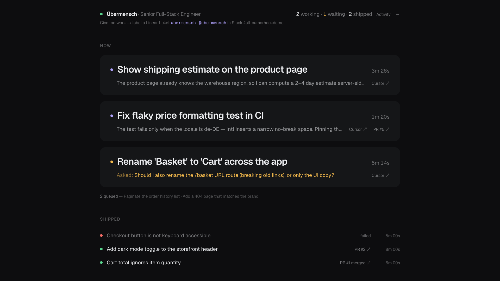
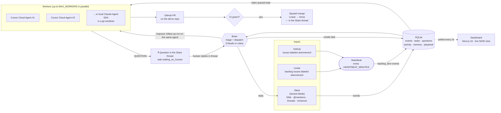

# Übermensch

**An AI coworker you hire, not prompt.**

You don't write prompts for Übermensch. You hire it: it interviews you in a Slack DM about its role
and writes its own job playbook. From then on it works in your Slack, Linear and GitHub. It notices
work nobody assigned, hands each task to its own coding agent, ships a pull request, merges it once
CI is green, and reports back in the thread. When something needs a human decision, such as a change
to payments code, it asks in Slack and waits for your answer.

> The one thing the demo proves: **it picks up work nobody assigned, does it, and asks a human only when stuck.**



---

## How it works



The daemon (`agent/`) and the dashboard (`src/app/`) are two processes that share one SQLite database
(`src/lib/db.ts`, WAL mode). `npm run dev` starts both.

### Hiring (onboarding)

1. You DM the bot `you're hired` (or `onboard`, `/hire`).
2. It interviews you one question at a time: role and name, what it owns and what "done" means, where
   work comes from, how autonomous to be, when to ask for help and whom, and how to report progress.
   Long, rambling, dictated answers are fine.
3. It writes a Markdown **playbook** (Identity, Responsibilities, Where work comes from, How I work,
   Autonomy & guardrails, When I ask for help, Team), stores it, and posts a short summary of what it
   understood. Every later triage decision and every worker prompt includes this playbook.

With an `ANTHROPIC_API_KEY`, Claude runs the interview and writes the playbook. Without one, the bot
runs a fixed 6-question interview and fills in a playbook template instead (see [No-LLM mode](#no-llm-mode)).

### Lifecycle of a task

1. **Something happens.**
   - *Reactive*: someone posts in the agent's channel, @mentions it, or DMs it. The Slack gateway
     (Socket Mode, no public URL) records the message as an event.
   - *Proactive*: the heartbeat polls Linear for unstarted issues carrying the `ubermensch` label and
     GitHub for open issues with the same label on the demo repo, then records each new one as a `backlog_item` event.
2. **The brain triages it** (every 2 s). Claude structured output, guided by the playbook and the
   list of open tasks, picks one action per event:
   - `reply`: a quick answer posted in the thread, with no task created.
   - `create_task`: a title, a self-contained brief for the worker, and a one-line acknowledgement.
   - `ignore`: noise, out of scope, or a duplicate of an open task.

   A reply in a thread where the agent asked a question is routed to `answer_question` directly,
   without a model call.
3. **A task is created.** For a Slack request the agent reacts with 👀, posts its plan in the thread,
   and mirrors the request into a new Linear issue. For a backlog item it announces in the channel:
   *"Picking up ENG-12: … nobody's on it, so I am."*
4. **A worker picks it up.** The dispatcher claims queued tasks until `MAX_WORKERS` are busy. By
   default each task becomes its own **Cursor Cloud Agent** (Cursor API v1) on the demo repo. The
   agent's prompt contains the playbook, the task brief and relevant memories from earlier tasks. The
   Linear issue moves to *In Progress*, and the agent's thinking and tool calls stream into the
   dashboard's activity feed.
5. **It ships.** Cursor opens a PR. If the playbook says merges need approval (e.g. *"after approval
   merge them"*), the daemon posts *"🔀 PR ready for review: <link>. Reply approve, or tell me what to
   change"* in the Slack thread and waits. **approve / lgtm / ship it** → it merges; **any other reply is
   treated as review feedback** and sent to the same Cursor agent, which updates the PR and asks again.
   Otherwise it merges on its own. Either way the daemon marks the PR ready, waits for CI, and
   squash-merges once every check is green, moves the Linear issue to *Done* (or *In Review* if the PR
   wasn't merged), posts 🚢 *Shipped* with a summary in the Slack thread, and saves the summary to
   long-term memory.
6. **Or it asks first.** If the playbook or the repo's rules say a human must approve (for example
   anything under `src/payments/`), the agent makes no change and ends its run with
   `QUESTION: …`. The daemon posts ❓ in the Slack thread and parks the task as `waiting_on_human`.
   When you reply in that thread, the brain records the answer and requeues the task. The worker then
   **resumes the same Cursor agent** with a follow-up run that carries your answer.

**Fallback worker** (`WORKER_BACKEND=claude`, or no `CURSOR_API_KEY`): a local Claude Agent SDK
session in its own git worktree of the demo repo, with a locked-down tool allowlist and its own
in-process MCP tools: `ask_human`, `report_progress`, `remember`, `recall` and `linear_update`. It
also gets Playwright, plus Exa and Firecrawl when their keys are set. When it pauses on `ask_human`,
the answer resumes the same SDK session.

---

## Demo in 60 seconds

The playground is **[ubermensch-demo](https://github.com/Yggdrasill501/ubermensch-demo)**, a tiny
shop API with four planted bugs and a CI gate.

1. **Hire it.** DM the bot `you're hired` and answer its questions. For example: *BackendDev*, owns the
   backend, merges after approval, asks before big changes like new DB tables. The playbook is saved and
   the dashboard header shows the role. (The interview is persisted, so a daemon restart mid-interview
   doesn't lose your answers.)
2. **Give it work, one of two ways:**
   - Add the `ubermensch` label to a Linear backlog ticket. On the next heartbeat it announces
     *"Picking up ENG-…"* in the channel and starts.
   - Or @mention it in Slack: *"@ubermensch checkout is throwing a 500 on an empty cart, can you fix it?"*
     It reacts with 👀, acknowledges in the thread, and opens a Linear issue.
3. **Watch the dashboard** at http://localhost:3000: a calm, single-column view of what's happening
   *now*. Each working task shows its latest thought, elapsed time and a live link to the Cursor agent;
   tasks waiting on you turn amber with the question. When the PR is ready it asks for approval in the
   thread; reply *approve* and it merges, moves Linear to Done, and posts 🚢 *Shipped*.
4. **Make it ask.** Ask it to stop refunds from exceeding the amount charged. That fix lives in
   payments code, so it asks you in the thread first. Reply *"yes, go ahead"* and it resumes and ships.

---

## Quick start

Requires Node 22 (`.nvmrc`).

```bash
nvm use
npm install
cp .env.example .env     # fill in keys, see the table below and docs/SETUP.md
npm run dev              # dashboard on http://localhost:3000 + the agent daemon
```

`npm run web` and `npm run agent` start each process on its own. [`docs/SETUP.md`](docs/SETUP.md)
covers creating the Slack app (manifest included), the GitHub token, Linear and Cursor step by step.

Only the keys you set are used. If an optional key is missing, the feature that needs it is skipped
and logged, and the daemon keeps running. For example, without Slack tokens the gateway is disabled,
and without Linear the heartbeat checks GitHub only.

## Configuration

Every variable from [`.env.example`](.env.example):

| Variable | Default | What it does |
|---|---|---|
| `ANTHROPIC_API_KEY` | *(empty)* | Claude for the onboarding interview, playbook writing and triage. Leave it empty for [no-LLM mode](#no-llm-mode). The Claude worker backend requires it. |
| `ANTHROPIC_MODEL` | `claude-opus-5-5` | Claude model used for the interview, triage and the Claude worker. |
| `SLACK_BOT_TOKEN` | | Bot token (`xoxb-…`) used to post messages and add reactions. |
| `SLACK_APP_TOKEN` | | App-level token (`xapp-…`, scope `connections:write`) for Socket Mode, so no public URL is needed. |
| `SLACK_DEFAULT_CHANNEL` | | Channel ID (`C…`) where the agent reports work. Every message in this channel is triaged. |
| `GITHUB_TOKEN` | | Fine-grained PAT scoped to the demo repo: Contents RW, Pull requests RW, Issues RW, Checks R. Used to list issues, poll CI, and mark ready and merge PRs. |
| `GITHUB_REPO` | | `owner/name` of the repo the agent works on (the demo repo, **not** this one). |
| `LINEAR_API_KEY` | | Linear personal API key. |
| `LINEAR_TEAM_KEY` | | Team key, e.g. `ENG`. Backlog issues are read from this team and new issues are created in it. |
| `LINEAR_LABEL` | `ubermensch` | Only issues with this label are picked up, in Linear (unstarted) and GitHub (open). An empty value picks up everything. |
| `EXA_API_KEY` | *(empty)* | Gives Claude workers Exa web search as an MCP server. |
| `FIRECRAWL_API_KEY` | *(empty)* | Gives Claude workers Firecrawl scraping as an MCP server. |
| `WORKSPACES_DIR` | `~/ubermensch-workspaces` | Where Claude workers clone the repo and create per-task git worktrees. |
| `MAX_WORKERS` | `3` | Maximum number of tasks worked on in parallel. |
| `WORKER_MAX_TURNS` | `80` | Turn limit per Claude worker session. |
| `HEARTBEAT_MINUTES` | `5` | How often Linear and GitHub are polled. The first poll runs 10 s after boot. |
| `WORKER_BACKEND` | `cursor` if `CURSOR_API_KEY` is set, else `claude` | `cursor` uses Cursor Cloud Agents. `claude` uses the local Claude Agent SDK in git worktrees. |
| `CURSOR_API_KEY` | *(empty)* | Cursor API key. Enables the Cursor Cloud Agent backend. |
| `CURSOR_MODEL` | *(Cursor default)* | Model ID for Cursor agents. |
| `AUTO_MERGE` | `true` | Squash-merge agent PRs once CI is green. Set it to `false` to leave PRs open for review. |
| `SKIP_CI` | `true` | Merge right away without waiting for CI checks. Set `false` to require green CI first. |
| `MERGE_APPROVAL` | `playbook` | `playbook`: ask for approval in Slack before merging if the playbook says so. `always` / `never` override it. |

`DB_PATH` (default `data/ubermensch.db`) is not in `.env.example`, but you can set it to move the
SQLite file, for example to a persistent disk.

---

## Project structure

```
agent/                      the daemon (Node 22, run with tsx)
  index.ts                  boots Slack, the heartbeat and the dispatcher
  config.ts                 all configuration, read from .env
  slack.ts                  Socket Mode gateway: routing, dedupe, postMessage / addReaction
  onboarding.ts             hiring interview: Claude or scripted, writes the playbook
  brain.ts                  triage (Claude structured output or rules) + dispatcher (fills worker slots)
  heartbeat.ts              proactive polling of the Linear backlog and GitHub issues
  worker.ts                 worker entry point; Claude Agent SDK backend in git worktrees
  worker-cursor.ts          Cursor Cloud Agents backend: create/follow-up runs, CI-gated merge
  tools.ts                  coworker MCP tools for Claude workers (ask_human, report_progress, memory, Linear)
  computer.ts               computer use (stub, see the roadmap)
  sources/linear.ts         Linear: backlog query, state changes, comments, issue creation
  sources/github.ts         GitHub: Octokit client, open issues
src/lib/db.ts               SQLite schema + queries shared by the daemon and the dashboard
src/app/                    Next.js 16 dashboard (Tailwind 4 + DaisyUI 5)
  api/state/route.ts        GET: tasks, activity, playbook, memory, questions (polled by the UI)
  api/tasks/route.ts        POST: create a task from the dashboard
docs/                       build docs from the hackathon: PLAN.md, SETUP.md, briefs/ (one per workstream)
```

## No-LLM mode

Leave `ANTHROPIC_API_KEY` empty and the agent still runs end to end:

- **Onboarding** becomes a scripted 6-question interview (role, ownership, work sources, autonomy,
  when to ask, style). The answers fill a playbook template with safe defaults. Reply
  *"that's enough"* to finish early.
- **Triage** becomes rule-based. Backlog items become tasks. So do @mentions with a real sentence,
  and DMs or channel messages that look like work ("fix", "bug", "500", "can you", …). Any other DM
  or @mention gets a friendly reply, and everything else is ignored.
- **Workers** still run on Cursor Cloud Agents when `CURSOR_API_KEY` is set, so the full
  Slack/Linear → PR → merge loop works without any Anthropic key. Add a key later and onboarding and
  triage switch to Claude automatically.

## Safety and guardrails

- **Label-gated pickup.** From Linear, the agent only takes *unstarted* issues that carry
  `LINEAR_LABEL` (`ubermensch`); from GitHub, only open issues in `GITHUB_REPO` with the same label,
  so strangers opening issues on a public repo can't hand it work. The brain still checks each one
  against the playbook's responsibilities.
- **Dedupe everywhere.** Every inbound event has a unique external ID: Slack `channel:ts`, the Linear
  issue ID, the GitHub issue number. A task is never created twice for the same source. The bot
  ignores its own messages and other bots' messages, so it cannot reply to itself in a loop. Claiming
  a queued task is a single SQLite transaction.
- **Bounded parallelism and cost.** At most `MAX_WORKERS` tasks run at once. Claude workers have a
  `WORKER_MAX_TURNS` limit, and each Cursor run has a 45-minute timeout.
- **CI-gated merge.** The daemon merges only after every check on the PR has completed successfully.
  A failed check leaves the PR open and reports why. `AUTO_MERGE=false` turns merging off entirely.
  (If the repo has no CI at all, the PR is merged after about 90 s of seeing no checks, so give your
  target repo a CI workflow.)
- **Ask before payments.** The playbook and the repo's `CLAUDE.md` define what needs human approval.
  The agent stops, asks in the Slack thread, and only continues once a human replies.
- **Human merge approval.** With `MERGE_APPROVAL` (from the playbook by default), nothing lands on
  `main` until someone replies *approve* in the task's Slack thread.
- **Scoped credentials.** Use a fine-grained PAT scoped to the demo repo only. Claude workers run
  headless with a tool allowlist, no force-push, no push to `main`, and no `gh api`, `gh auth` or
  `sudo`. Their environment is scrubbed so Slack and Linear secrets never reach the agent process.

## Roadmap and vision

- **Recording-based skills.** Record yourself doing a job in a hard UI (browser recordings or a screen
  capture). The agent turns the recording into a skill it replays with computer use.
  `agent/computer.ts` and the `use_computer` tool are already wired as a stub.
- **Any role, not only engineering.** The role is whatever the interview defines. Design, ops,
  support or sales need a different playbook and a different set of tools, not a different product.
- **Linear app user.** The agent becomes a real assignee: assign a ticket to it instead of adding a
  label, and receive webhooks instead of polling.
- **Render deploy.** One web service with a persistent disk (`DB_PATH`, `WORKSPACES_DIR`). Socket Mode
  means no inbound webhooks are needed. Steps are in [`docs/SETUP.md`](docs/SETUP.md#deploy-to-render-after-it-works-locally).
- **Hermes-style long-term memory.** Replace today's keyword recall over task summaries and learnings
  with self-improving memory that gets better at the job over time.

## Credits

Built in one day at the **Cursor Hackathon Prague** (September 2026).

- [Cursor](https://cursor.com): Cloud Agents API for the workers, and the editor we built it in
- [Anthropic Claude](https://www.anthropic.com): onboarding, triage and the Claude Agent SDK fallback worker
- [Render](https://render.com): deployment target
- [Exa](https://exa.ai) and [Firecrawl](https://firecrawl.dev): research tools for workers
- [Wispr Flow](https://wisprflow.ai): dictating the onboarding interview live on stage

Build notes from the day: [`docs/PLAN.md`](docs/PLAN.md) (architecture, workstreams, demo script) and
[`docs/briefs/`](docs/briefs/) (the brief each parallel coding session built from).
